<div align="center">

# WORKFLOW

```mermaid
graph TB
    %% Left branch - NPT Equilibration
    L1([⚛ Build Box Simulation ])
    L2([⚛ Charge Scaling])
    L3([⚛ Energy Minimization])
    L4([⚛ Annealing])
    L5([⚛ NVT Equilibration])
    L6([⚛ NPT Equilibration])
    L7([⚛ NPT Equilibration cont.])
    L8([⚛ NPT Production])
    L9([📊 Analysis])
    L10([📈Density])
    L11([📈Box Size])
    

    %% Right branch - NVT Equilibration
    R1([📈Box Size])
    R2([⚛ Build Box Simulation])
    R3([⚛ Charge Scaling])
    R4([⚛ Energy Minimization])
    R5([⚛ Annealing])
    R6([⚛ NVT Equilibration])
    R7([⚛ NVT Production])
    R8([📊 Analysis])
    R9([📈 Ionic Conductivity])
    R10([📈RDF])
    R11([📈MSD])

    %% Connections
    L1 --> L2 --> L3 --> L4 --> L5 --> L6 --> L7 --> L8 --> L9
    L9 --> L10
    L9 --> L11
    

    R1 --> R2 --> R3 --> R4 --> R5 --> R6 -->R7--> R8
    R8 --> R9
    R8 --> R10
    R8 --> R11
```



</div>


--------
--------
<div align="center">

# SIMULATION

</div>


## A. NPT Production
### A.1. Build Box Simulation


**STEP 1. Generates input file for Packmol using fftool**
- **files** : [Na.zmat](input_file/Na.zmat) , [c3c1pyrr.zmat](input_file/c3c1pyrr.zmat), [ntf2.zmat](input_file/ntf2.zmat), and [il.ff](input_file/il.ff)
- **script** : [fftool](script/FFTool)
  <details>
    <summary><em>brief overview</em></summary>
    <ul>
      <li>.zmat files → molecular structures in z-matrix format (atom positions defined by bond lengths, angles, and dihedrals), used to build initial molecules.</li>
      <li>il.ff file → a database of force field parameters for ions of various ionic liquids, including atom types, charges, bond lengths, angles, dihedrals, and van der Waals interactions</li>
      <li>fftool → generates initial molecular structures from z-matrix and force field files (il.ff), prepares input for Packmol to construct a simulation box, and from the resulting simulation box, generates input files suitable for simulations (specifically GROMACS)</li>
    </ul>    
    </details>
- **command** : replace placeholders with the number of ions*
  ```
  ./fftool <n_Na> Na.zmat <n_pyr13> c3c1pyrr.zmat <n_TFSI> ntf2.zmat -r 1.5
  ```
- **example**
  ```
  ./fftool 19 Na.zmat 171 c3c1pyrr.zmat 190 ntf2.zmat -r 1.5 
  ```
  <details>
  <summary><em>expected terminal output</em></summary>
  <pre>
    density 1.500 mol/L  volume 420679.7 A^3
    molecule_file      species           nmol force_field      natom nbond source  charge
      Na.zmat          Na+                 19 il.ff                1     0 file   +1.0000
      c3c1pyrr.zmat    c3c1pyrr+          171 il.ff               27    27 file   +1.0000
      ntf2.zmat        tf2N-              190 il.ff               15    14 file   -1.0000
    packmol file
    pack.inp
  </pre>
  </details>
- **output file** : `pack.inp`


**STEP 2. Generates initial configurations using Packmol**
- **files** : `pack.inp`
- **software** : [Packmol](http://www.ime.unicamp.br/~martinez/packmol/)
- **command** :
  - search module 
    ```
    module avail packmol
    ```
    <details>
    <summary><em>expected terminal output</em></summary>
      <pre>
    ------------------------------------------------------- /mgpfs/apps/modulefiles -------------------------------------------------------
     nuclear/packmol/20.14.4
  
    If the avail list is too long consider trying:
  
    "module --default avail" or "ml -d av" to just list the default modules.
    "module overview" or "ml ov" to display the number of modules for each name.
  
    Use "module spider" to find all possible modules and extensions.
    Use "module keyword key1 key2 ..." to search for all possible modules matching any of the "keys".
      </pre>
      </details>
  - load module
    ```
    module load nuclear/packmol/20.14.4
    ```
  - check module
    ```
    module list
    ```
    <details>
    <summary><em>expected terminal output</em></summary>
    <pre>
      Currently Loaded Modules:
      1) prun/2.2       3) hwloc/2.7.0   5) libfabric/1.13.0   7) singularity/3.7.1   9) readline/8.2
      2) gnu12/12.2.0   4) ucx/1.14.0    6) openmpi4/4.1.4     8) ohpc               10) nuclear/packmol/20.14.4
    </pre>
    </details>

    > 💡 Note: On HPC systems, you only need to load the required software (Packmol) **once per session**.  
    > If you log out or start a new session, you need to load it again before running the commands.
  - generates initial configurations
    ```
    packmol < pack.inp
    ```
      <details>
      <summary><em>expected terminal output</em></summary>
      <pre>
        ################################################################################
        
         PACKMOL - Packing optimization for the automated generation of
         starting configurations for molecular dynamics simulations.
         
                                                                      Version 20.3.5 
        
        ################################################################################
        
          Packmol must be run with: packmol < inputfile.inp 
        
          Userguide at: http://m3g.iqm.unicamp.br/packmol 
        
          Reading input file... (Control-C aborts)
          Seed for random number generator:      1234567
          Output file: simbox.xyz
          Reading coordinate file: ilff/Na_pack.xyz
          Number of independent structures:            1
          The structures are: 
          Structure            1 :Na+ il.ff(           1  atoms)
          Maximum number of GENCAN loops for all molecule packing:          200
          Total number of restrictions:            1
          Distance tolerance:    2.5000000000000000     
          Number of molecules of type            1 :           20
          Total number of atoms:           20
          Total number of molecules:           20
          Number of fixed molecules:            0
          Number of free molecules:           20
          Number of variables:          120
          Total number of fixed atoms:            0
          Maximum internal distance of type            1 :    0.0000000000000000     
          All atoms must be within these coordinates: 
           x: [   -998.39999999999998      ,    1001.6000000000000       ] 
           y: [   -998.39999999999998      ,    1001.6000000000000       ] 
           z: [   -998.39999999999998      ,    1001.6000000000000       ] 
          If the system is larger than this, increase the sidemax parameter. 
        
        ################################################################################
        
          Building initial approximation ... 
        
        ################################################################################
        
          Adjusting initial point to fit the constraints 
        
        --------------------------------------------------------------------------------
        
        --------------------------------------------------------------------------------
        
          Molecules of type:            1
        
          Packing:|0                                                             100%|
                  |*******
        
          Restraint-only function value:    7.6356809804166854E-014
          Maximum violation of the restraints:    1.7918856863805915E-014
        
        --------------------------------------------------------------------------------
        
          Rescaling maximum and minimum coordinates... 
          Computing size of patches... 
          Add fixed molecules to permanent arrays... 
          Reseting center of mass... 
        
        --------------------------------------------------------------------------------
        
          Setting initial trial coordinates ... 
        
        --------------------------------------------------------------------------------
        
        --------------------------------------------------------------------------------
        
          Molecules of type:            1
          Adjusting random positions to fit the constraints. 
          Restraint-only function value:    0.0000000000000000     
          Maximum violation of the restraints:    0.0000000000000000     
        
        ################################################################################
        
          Objective function at initial point:    0.0000000000000000     
        
        ################################################################################
        
          Packing molecules of type:            1
        
        ################################################################################
        
        
          Initial approximation is a solution. Nothing to do. 
        
          Current point written to file: simbox.xyz
        --------------------------------------------------------------------------------
          Packing solved for molecules of type           1
          Objective function value:    0.0000000000000000     
          Maximum violation of target distance:    0.0000000000000000     
          Max. constraint violation:    0.0000000000000000     
        --------------------------------------------------------------------------------
        
        ################################################################################
        
          Packing all molecules together 
        
        ################################################################################
        
        
          Initial approximation is a solution. Nothing to do. 
        
          Solution written to file: simbox.xyz
        
        ################################################################################
        
                                         Success! 
                      Final objective function value: .00000E+00
                      Maximum violation of target distance:   0.000000
                      Maximum violation of the constraints: .00000E+00
        
        --------------------------------------------------------------------------------
        
                      Please cite this work if Packmol was useful: 
        
                   L. Martinez, R. Andrade, E. G. Birgin, J. M. Martinez, 
                 PACKMOL: A package for building initial configurations for
                           molecular dynamics simulations. 
                  Journal of Computational Chemistry, 30:2157-2164,2009.
        
        ################################################################################
        
           Running time:    1.27600040E-03  seconds. 
        
        -------------------------------------------------------------------------------
      </pre>
      </details>
- **output file** : `simbox.xyz`, `c3c1pyrr_pack.xyz`, `ntf2_pack.xyz`, `Na_pack.xyz`


**STEP 3. Generates input file for Gromacs**
- **files** : `simbox.xyz`, [Na.zmat](input_file/Na.zmat) , [c3c1pyrr.zmat](input_file/c3c1pyrr.zmat), [ntf2.zmat](input_file/ntf2.zmat), and [il.ff](input_file/il.ff)
- **script** : [fftool](script/FFTool)
- **command** : replace placeholders with the number of ions*
  ```
  ./fftool <n_Na> Na.zmat <n_pyr13> c3c1pyrr.zmat <n_TFSI> ntf2.zmat -r 1.5 -g
  ```
- **example**
  ```
  ./fftool 19 Na.zmat 171 c3c1pyrr.zmat 190 ntf2.zmat -r 1.5 -g
  ```
  <details>
    <summary><em>expected terminal output</em></summary>
  <pre>
  density 1.500 mol/L  volume 420679.7 A^3
  molecule_file      species           nmol force_field      natom nbond source  charge
    Na.zmat          Na+                 19 il.ff                1     0 file   +1.0000
    c3c1pyrr.zmat    c3c1pyrr+          171 il.ff               27    27 file   +1.0000
    ntf2.zmat        tf2N-              190 il.ff               15    14 file   -1.0000
  gromacs files
    run.mdp
    field.top
    config.pdb
  </pre>
  </details>
- **output file** : `run.mdp`, `field.top`, and `config.pdb`


**STEP 4. Convert the PDB structure into a GROMACS-compatible GRO file**
- **files** : `config.pdb`
- **software** : [GROMACS](https://www.gromacs.org)
- **command** :
  - search module
    ```
    module avail gromacs
    ```
    <details>
    <summary><em>expected terminal output</em></summary>
    <pre>
    ------------------------------------------------------- /mgpfs/apps/modulefiles -------------------------------------------------------
       bioinformatics/gromacs/2023-plumed-mpi    bioinformatics/gromacs/2023-plumed    bioinformatics/gromacs/2023.3-mpi (D)
    
      Where:
       D:  Default Module
    
    If the avail list is too long consider trying:
    
    "module --default avail" or "ml -d av" to just list the default modules.
    "module overview" or "ml ov" to display the number of modules for each name.
    
    Use "module spider" to find all possible modules and extensions.
    Use "module keyword key1 key2 ..." to search for all possible modules matching any of the "keys".
    </pre>
    </details>
  - module load
    ```
    module load bioinformatics/gromacs/2023.3-mpi
    ```
  - module check
    ```
    module list
    ```
    <details>
    <summary><em>expected terminal output</em></summary>
    <pre>
    Currently Loaded Modules:
      1) prun/2.2       4) ucx/1.14.0         7) singularity/3.7.1  10) mpi/2021.10.0      13) bioinformatics/plumed/2.9.0
      2) gnu12/12.2.0   5) libfabric/1.13.0   8) ohpc               11) fftw/3.3.8-shared  14) bioinformatics/gromacs/2023.3-mpi
      3) hwloc/2.7.0    6) openmpi4/4.1.4     9) python/3.9.16      12) gcc/12.2.0
    </pre>
    </details>
 
    > 💡 Note: On HPC systems, you only need to load the required software (Gromacs) **once per session**.  
    > If you log out or start a new session, you need to load it again before running the commands.
  - Convert the .pdb to .gro format
    ```
    gmx_mpi editconf -f <file.pdb> -o <file.gro>
    ```
- **example**
  ```
  gmx_mpi editconf -f config.pdb -o config.gro
  ```
  <details>
  <summary><em>expected terminal output</em></summary>
  <pre>
  Command line:
    gmx editconf -f config.pdb -o config.gro
  
  Note that major changes are planned in future for editconf, to improve usability and utility.
  WARNING: all CONECT records are ignored
  Read 7486 atoms
  Volume: 420.678 nm^3, corresponds to roughly 189300 electrons
  No velocities found
  
  GROMACS reminds you: "A C program is like a fast dance on a newly waxed dance floor by people carrying razors." (Waldi Ravens)
  </pre>
  </details>
- **output file** :`config.gro`


### A.2. Charge Scaling
- **files** : `field.top`
- **script** : [charge_scaling.py](script/charge_scaling)
- **command** : replace placeholders with scaling factor
  ```
  python3 scaling.py field.top <scaling_factor>
  ```
- **example**
    ```
    python3 scaling.py field.top 0.70
    ```
   <details>
    <summary><em>expected terminal output</em></summary>
    <pre>
    Reading input file: field.top
    Scaling charges with factor: 0.7
    Scaling charges completed:
    - Total atoms scaled in [ atoms ]: 43
    - Total atomtypes scaled in [ atomtypes ]: 13
    Writing scaled output to: field_scaled_0.7000.top
    Done!
    </pre>
    </details>

  - **output file** : `field_scaled_0.7000.top`
  


### A.3 Energy Minimization
- **software** : [GROMACS](https://www.gromacs.org)

**STEP 1. Gromacs Preprocessor / Input Preparation**
- **files** : `config.gro`, `field_scaled_0.7000.top`, `em.mdp`
- **command** :

  ```
  gmx_mpi grompp -f em.mdp -p field_scaled_0.7000.top -c config.gro -o em.tpr
  ```
- **output file** : `em.tpr`

**STEP 2. Running the Energy Minimization**
- **files** : `em.tpr`
- **command** :

  ```
  gmx_mpi mdrun -v -deffnm em
  ```
  > 💡 Note: Running GROMACS simulations (using gmx mdrun) can take a long time  
  > For faster and more convenient execution on HPC systems, it is recommended to run it using SLURM.

  - **Slurm batch script** `em.sh`
    ```
    #!/bin/bash
  
    #SBATCH -J em
    #SBATCH --nodes=1
    #SBATCH --ntasks=64
    #SBATCH --partition=short
    
    #SBATCH -o out_%j.out
    #SBATCH -e err_%j.err
    
    module load openmpi4/4.1.4
    module load bioinformatics/gromacs/2023.3-mpi
    
    
    export OMP_NUM_THREADS=64
    
    date
    
    gmx_mpi mdrun -v -deffnm em
    
    date
  
    ```
  - **command** :
    ```
    sbacth em.sh
    ```
  - **output files** : `.err` and `.out`
- **output files** : `em.edr`, `em.gro`,`em.log`, and `em.trr`


### A.4 Annealing
- **software** : [GROMACS](https://www.gromacs.org)

**STEP 1. Create an index file for annealing**
- **files** : `em.tpr`
- **command** :
  ```
  gmx_mpi make_ndx -f em.tpr -o em.ndx
  ```
  <details>
  <summary><em>expected terminal output</em></summary>
  <pre>
  Lorem ipsum
  </pre>
  </details>

- **output file** : `em.ndx`
  

**STEP 2. Gromacs Preprocessor / Input Preparation**
- **files** : `em.gro`, `em.ndx`, `field_scaled_0.7000.top`, `an.mdp`
- **command** :
  ```
  gmx_mpi grompp -f an.mdp -p field_scaled_0.7000.top -c em.gro -n em.ndx -o an.tpr
  ```
- **output file** : `an.tpr`


**STEP 3. Running the Annealing**
- **files** : `an.tpr`
- **command** :
  ```
  gmx_mpi mdrun -v -deffnm an
  ```
  > 💡 Note: Running GROMACS simulations (using gmx mdrun) can take a long time  
  > For faster and more convenient execution on HPC systems, it is recommended to run it using SLURM.
  - **Slurm batch script** `an.sh`
    ```
    #!/bin/bash
  
    #SBATCH -J an
    #SBATCH --nodes=1
    #SBATCH --ntasks=64
    #SBATCH --partition=short
    
    #SBATCH -o out_%j.out
    #SBATCH -e err_%j.err
    
    module load openmpi4/4.1.4
    module load bioinformatics/gromacs/2023.3-mpi
    
    
    export OMP_NUM_THREADS=64
    
    date
    
    gmx_mpi mdrun -v -deffnm an
    
    date
  
    ```
  - **command** :
    ```
    sbacth an.sh
    ```
  - **output files** : `.err` and `.out`
- **output files** : `an.edr`, `an.gro`,`an.log`, and `an.trr`


### A.5 NVT Equilibration

- **software** : [GROMACS](https://www.gromacs.org)
  
**STEP 1. Gromacs Preprocessor / Input Preparation**
- **files** : `an.gro`, `field_scaled_0.7000.top`, `eq_nvt.mdp`
- **command** :
  ```
  gmx_mpi grompp -f eq_nvt.mdp -p field_scaled_0.7000.top -c an.gro -o eq_nvt.tpr
  ```
- **output file** : `eq_nvt.tpr`


**STEP 2. Running the NVT Equilibration**
- **files** : `eq_nvt.tpr`
- **command** :
  ```
  gmx_mpi mdrun -v -deffnm eq_nvt
  ```
  > 💡 Note: Running GROMACS simulations (using gmx mdrun) can take a long time  
  > For faster and more convenient execution on HPC systems, it is recommended to run it using SLURM.
  - **Slurm batch script** `eq_nvt.sh`
    ```
    #!/bin/bash
  
    #SBATCH -J eq_nvt
    #SBATCH --nodes=1
    #SBATCH --ntasks=64
    #SBATCH --partition=short
    
    #SBATCH -o out_%j.out
    #SBATCH -e err_%j.err
    
    module load openmpi4/4.1.4
    module load bioinformatics/gromacs/2023.3-mpi
    
    
    export OMP_NUM_THREADS=64
    
    date
    
    gmx_mpi mdrun -v -deffnm eq_nvt
    
    date
  
    ```
  - **command** :
    ```
    sbacth em.sh
    ```
  - **output files** : `.err` and `.out`
- **output files** : `eq_nvt.edr`, `eq_nvt.gro`,`eq_nvt.log`, and `eq_nvt.trr`


### A.6 NPT Equilibration
- **software** : [GROMACS](https://www.gromacs.org)
  
**STEP 1. Gromacs Preprocessor / Input Preparation**
- **files** : `eq_nvt.gro`, `field_scaled_0.7000.top`, `eq_npt.mdp`
- **command** :
  ```
  gmx_mpi grompp -f eq_npt.mdp -p field_scaled_0.7000.top -c eq_nvt.gro -o eq_npt.tpr
  ```
- **output file** : `eq_npt.tpr`


**STEP 2. Running the NPT Equilibration**
- **files** : `eq_npt.tpr`
- **command** :
  ```
  gmx_mpi mdrun -v -deffnm eq_npt
  ```
  > 💡 Note: Running GROMACS simulations (using gmx mdrun) can take a long time  
  > For faster and more convenient execution on HPC systems, it is recommended to run it using SLURM.
  - **Slurm batch script** `eq_npt.sh`
    ```
    #!/bin/bash
  
    #SBATCH -J eq_npt
    #SBATCH --nodes=1
    #SBATCH --ntasks=64
    #SBATCH --partition=short
    
    #SBATCH -o out_%j.out
    #SBATCH -e err_%j.err
    
    module load openmpi4/4.1.4
    module load bioinformatics/gromacs/2023.3-mpi
    
    
    export OMP_NUM_THREADS=64
    
    date
    
    gmx_mpi mdrun -v -deffnm eq_npt
    
    date
  
    ```
  - **command** :
    ```
    sbacth eq_npt.sh
    ```
  - **output files** : `.err` and `.out`
- **output files** : `eq_npt.edr`, `eq_npt.gro`,`eq_npt.log`, and `eq_npt.trr`


### A.7 NPT Equilibration cont.
- **software** : [GROMACS](https://www.gromacs.org)

**STEP 1. Gromacs Preprocessor / Input Preparation**
- **files** : `eq_npt.gro`, `field_scaled_0.7000.top`, `eq_npt_cont.mdp`
- **command** :
  ```
  gmx_mpi grompp -f eq_npt_cont.mdp -p field_scaled_0.7000.top -c eq_npt.gro -o eq_npt_cont.tpr
  ```
- **output file** : `eq_npt_cont.tpr`


**STEP 2. Running the NPT Equilibration cont.**
- **files** : `eq_npt_cont.tpr`
- **command** :
  ```
  gmx_mpi mdrun -v -deffnm eq_npt_cont
  ```
  > 💡 Note: Running GROMACS simulations (using gmx mdrun) can take a long time  
  > For faster and more convenient execution on HPC systems, it is recommended to run it using SLURM.
  - **Slurm batch script** `eq_npt_cont.sh`
    ```
    #!/bin/bash
  
    #SBATCH -J eq_npt_cont
    #SBATCH --nodes=1
    #SBATCH --ntasks=64
    #SBATCH --partition=short
    
    #SBATCH -o out_%j.out
    #SBATCH -e err_%j.err
    
    module load openmpi4/4.1.4
    module load bioinformatics/gromacs/2023.3-mpi
    
    
    export OMP_NUM_THREADS=64
    
    date
    
    gmx_mpi mdrun -v -deffnm eq_npt_cont
    
    date
  
    ```
  - **command** :
    ```
    sbacth eq_npt_cont.sh
    ```
  - **output files** : `.err` and `.out`
- **output files** : `eq_npt_cont.edr`, `eq_npt_cont.gro`,`eq_npt_cont.log`, and `eq_npt_cont.trr`


### A.8 NPT Production
- **software** : [GROMACS](https://www.gromacs.org)
  
**STEP 1. Gromacs Preprocessor / Input Preparation**
- **files** : `eq_npt_cont.gro`, `field_scaled_0.7000.top`, `prod_npt.mdp`
- **command** :
  ```
  gmx_mpi grompp -f prod_npt.mdp -p field_scaled_0.7000.top -c eq_npt_cont.gro -o prod_npt.tpr
  ```
- **output file** : `prod_npt.tpr`


**STEP 2. Running the NPT Production**
- **files** : `prod_npt.tpr`
- **command** :

  ```
  gmx_mpi mdrun -v -deffnm prod_npt
  ```
  > 💡 Note: Running GROMACS simulations (using gmx mdrun) can take a long time  
  > For faster and more convenient execution on HPC systems, it is recommended to run it using SLURM.
  - **Slurm batch script** `prod_npt.sh`
    ```
    #!/bin/bash
  
    #SBATCH -J prod_npt
    #SBATCH --nodes=1
    #SBATCH --ntasks=64
    #SBATCH --partition=short
    
    #SBATCH -o out_%j.out
    #SBATCH -e err_%j.err
    
    module load openmpi4/4.1.4
    module load bioinformatics/gromacs/2023.3-mpi
    
    
    export OMP_NUM_THREADS=64
    
    date
    
    gmx_mpi mdrun -v -deffnm prod_npt
    
    date
  
    ```
  
  - **command** :
    ```
    sbacth prod_npt.sh
    ```
  - **output files** : `.err` and `.out`
- **output files** : `prod_npt.edr`, `prod_npt.gro`,`prod_npt.log`, and `prod_npt.trr`


--------
--------
<div align="center">

#  DATA ANALYSIS

</div>


## A. NPT Production

### A.1. Box Size

- **files** : `prod_npt.edr`
- **software** : [GROMACS](https://www.gromacs.org)
- **command** :
  ```
  gmx_mpi energy -f prod_npt.edr -o box_prod_npt.xvg | tee box_mean.txt 
  ```
- **output file** : `box_prod_npt.xvg` , `box_mean.txt`


### A.2. Density
- **files** : `prod_npt.edr`
- **software** : [GROMACS](https://www.gromacs.org)
- **command** :

  ```
  gmx_mpi energy -f prod_npt.edr -o density_prod_npt.xvg | tee density_mean.txt 
  ```
- **output file** : `density_prod_npt.xvg` , `box_mean.txt`


--------
--------
<div align="center">

#  OPTIONAL

</div>
 


## A. Extend Simulation


## B. Trajectory Compression


