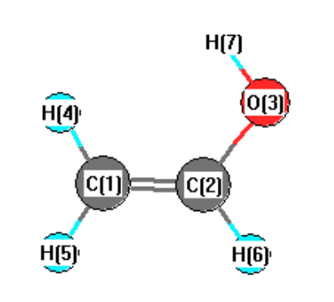

# Input Files

This folder contains initial input files used to build box simulation.

### Brief Overview

##### A. Z-matriks (.zmat)

Z-matrix is also called as internal coordination representation because the positition of each atom is not given directly by Cartesian coordinate (x, y, z) , instead defined relative to other atoms in terms of bond length, bond angle, and dihedral angle.

Example:
Ethanol CH<sub>2</sub>CHOH

```
| Index | Atom | RefB | BondLen | RefA | Angle  | RefD | Dihedral |
|-------|------|------|---------|------|--------|------|----------|
| 1     | C    | –    | –       | –    | –      | –    | –        |
| 2     | C    | 1    | 1.3176  | –    | –      | –    | –        |
| 3     | O    | 2    | 1.3471  | 1    | 126.9324 | –  | –        |
| 4     | H    | 1    | 1.0769  | 2    | 122.3434 | 3  | 0.0      |
| 5     | H    | 1    | 1.0728  | 2    | 120.1661 | 3  | 180.0    |
| 6     | H    | 2    | 1.0735  | 1    | 122.4584 | 4  | 180.0    |
| 7     | H    | 3    | 0.9484  | 2    | 110.3399 | 1  | 0.0      |
```

<p align="center">
  
</p>

<p align="center">
  <em>Source: 
    <a href="https://cccbdb.nist.gov/" target="_blank">
      Computational Chemistry Comparison and Benchmark DataBase (CCCBDB), Release 22, Standard Reference Database 101, NIST
    </a>
  </em>
</p>

##### B. Cartesian coordinate (.xyz)

Cartesian coordinates provide the absolute positions of atoms in three-dimensional space using x, y, and z coordinates, rather than defining positions relative to other atoms like in a Z-matrix.

Example:
Ethanol CH<sub>2</sub>CHOH

```
| Atom | X        | Y        | Z        |
|------|----------|----------|----------|
| C    | -8.63981 | 4.31439  | -0.00584 |
| C    | -7.30942 | 4.26359  | -0.00989 |
| H    | -9.20278 | 4.18900  | 0.91189  |
| H    | -9.19043 | 4.48308  | -0.92546 |
| H    | -6.71091 | 4.09837  | 0.87658  |
| O    | -6.58873 | 4.41972  | -1.15823 |
| H    | -5.64372 | 4.34483  | -0.93718 |
```

<p align="center">
  <em>Coordinates generated using <a href="https://avogadro.cc/" target="_blank">Avogadro</a> application</em>
</p>

## Source / Attribution

- Material files (force fields, and input files for ions) were provided by **CL&P**.
- Please refer to [Clandp repository](https://github.com/paduagroup/clandp) for details and licensing information.

## License

- The input files themselves are licensed under **MIT License** .
- Full license text is available in [LICENSE](./LICENSE)
